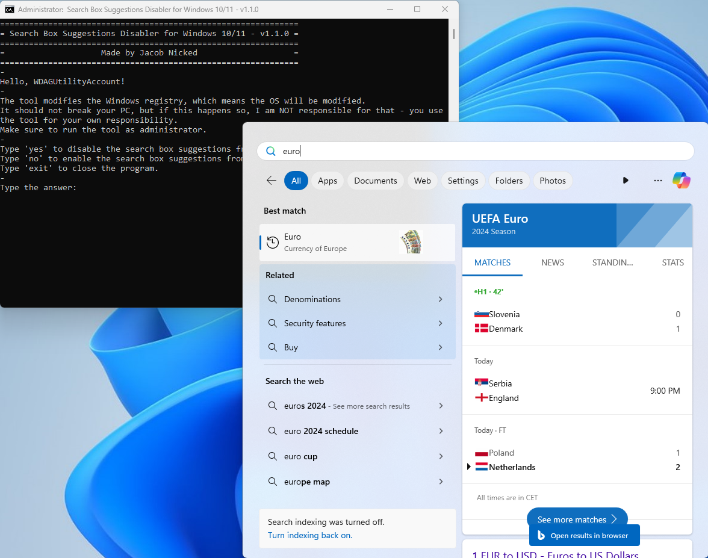
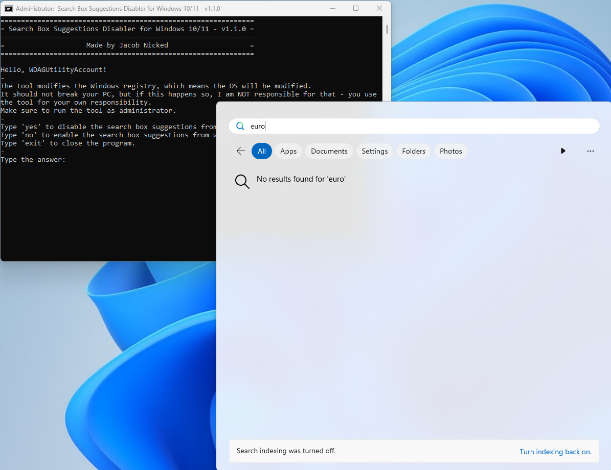

# Search Box Suggestions Disabler for Windows 10/11

Search Box Suggestions Disabler for Windows 10/11 disables web suggestions in system's search feature.

Imagine, you are finding an app, a file, or something else on your computer, but instead of getting a list of results from your computer, you're shown search results in Bing, which is not what you want.

 

This tool disables the web suggestions to make finding your stuff easier and faster.

 

## Screenshots
**Before**   <kbd></kbd>  
**After**   <kbd></kbd>
